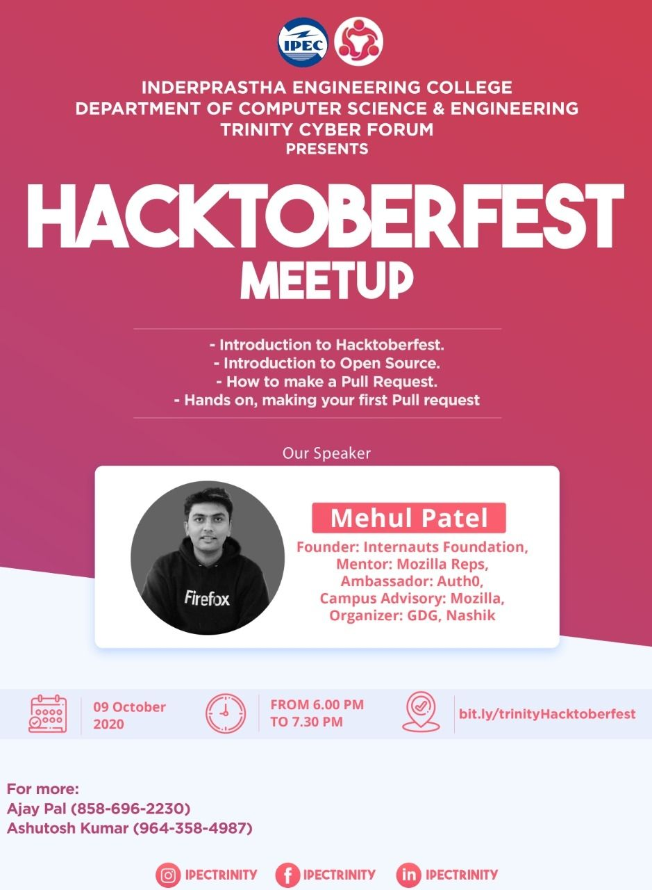

#  SecurityVue India Webinar

**About webinar** : Hacktoberfest — brought to you by DigitalOcean in partnership with Dev & Intel — is a month-long celebration of open-source software. Maintainers are invited to guide would-be contributors towards issues that will help move the project forward, and contributors get the opportunity to give back to both projects they like and others they've just discovered. No contribution is too small — bug fixes and documentation updates are valid ways of participating. 

### Talk Details 

* **Title**: Hacktoberfest : Intro. to OpenSource 
* **Talk Abstract**: In this session, we’ll talk about the Open source and understand how you can start effective contribution to world of FOSS. 
* **Date**: 9th October 2020
* **Time**: 06.00 PM to 07.30 PM
* **Register [here](https://organize.mlh.io/participants/events/4479-hacktoberfest-meetup-by-trinity-cyber-forum-ipec)**

Special thanks to [ Trinity Cyber Forum ](https://www.linkedin.com/company/trinity-cyber-forum/) for hosting me.

#### Event type: Public

<h2><a href="https://gist.github.com/rowdymehul/79adfda0bbe5299ab551c772f8b21a8d">Git Cheat Sheet</a></h2>

Feel free to ping me anytime on [Telegram](http://telegram.me/rowdymehul) or [Twitter](http://twitter.com/rowdymehul) and I’m happy to chat with you.

For any queries raise a [issue](https://github.com/rowdymehul/Hacktoberfest-2020/issues) and please feel free to submit a PR anytime :)

